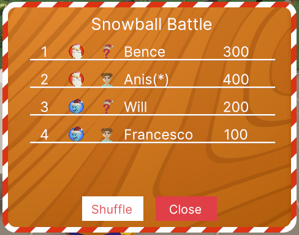
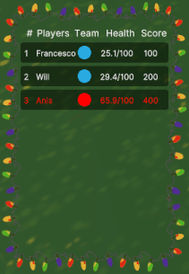

# Leaderboard sdk7

This demo scene present 2 different leaderboards made using sdk7. 
Both of them where drawn by the ones present in the [Snowball Arena](https://github.com/decentraland-scenes/snowball-xmas-arena).

#### **Modal Leader Board **



#### **HUD Leader Board **



# Instructions

Point to the cube in the center of the screen, press "E" and see the leader boards changing data.


## Try it out

**Install the CLI**
Download and install the Decentraland CLI by running the following command:

```
$ npm i -g decentraland
```

**sdk version**
Inside the package.json make sure that  sdk version is set to "next"

```
"devDependencies": {
"@dcl/sdk": "next"
},
```

**Previewing the scene**
Download this example and navigate to its directory, then run:

```
$  npm run start
```